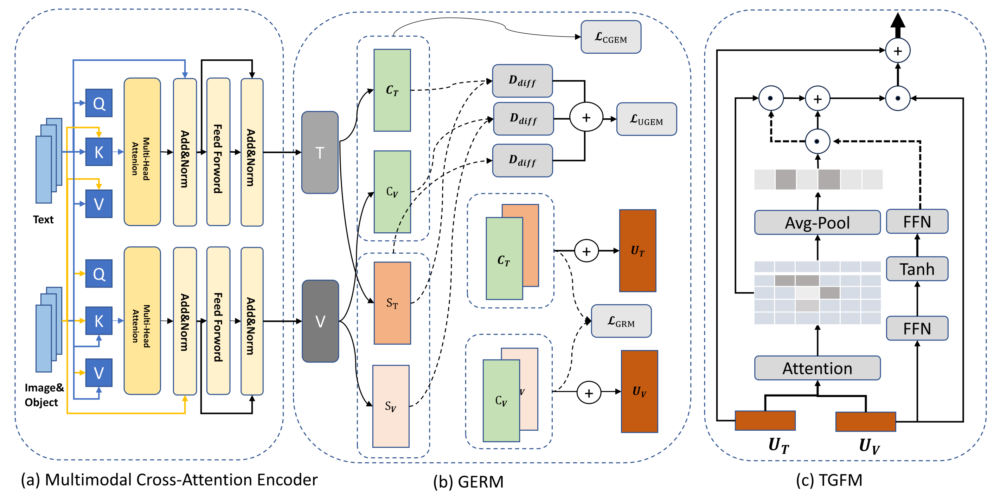
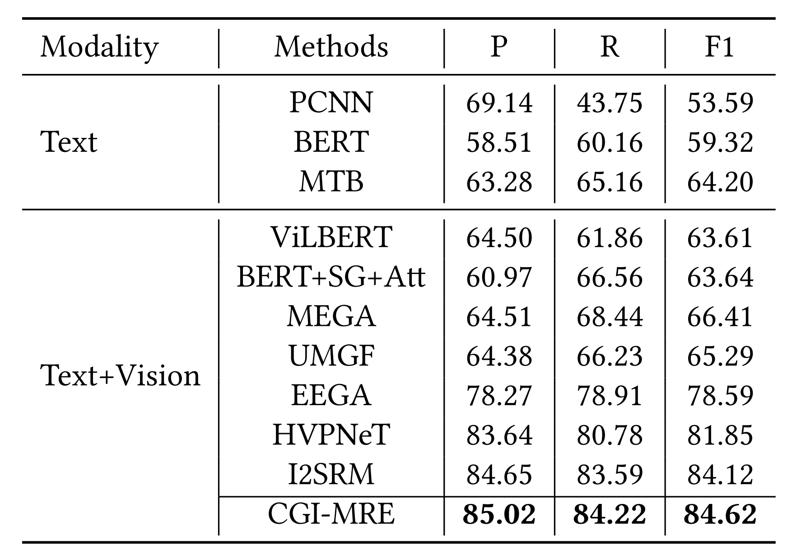

# Source Code of CGI-MRE Model for Multimodal Relation Extraction
Implementation of Our Paper "**CGI-MRE: A Comprehensive Genetic-Inspired Model For Multimodal Relation Extraction**" in ACM ICMR 2024. This Implementation is based on the [DeepKE](https://github.com/zjunlp/DeepKE).

## Model Architecture
<div align=center>

</div>

<!--  -->

The Overall Framework of Our Proposed **CGI-MRE** Model. We propose <ins>an innovative MRE method inspired by genetics</ins>. It consists of two main modules: **Gene Extraction And Recombination Module (GERM)** and **Text-Guided Fusion Module (TGFM)**. In the GERM module, we regard the text features and visual features as a feature body respectively, and decompose each feature body into common sub-features and unique sub-features. For these sub-features, we designed a **Common Gene Extraction Mechanism (CGEM)** to extract common advantageous genes in different modalities, a **Unique Gene Extraction Mechanism (UGEM)** to extract unique advantageous genes in each modality, and we finally use a **Gene Recombination Mechanism (GRM)** to obtain recombinant features that highly correlated with different modalities and have strong semantic consistency. In TGFM module, we organically fuse and extract the features in the recombined features that are beneficial to MRE. We use gate to adjust the text-guided original attention score and pooling attention score to obtain the **text-guided saliency attention score**. We can use this score to strictly extract information that is text-guided and beneficial to MRE from the image recombinant feature. Experimental results on the MNRE dataset show that our model outperforms the state-of-the-art performance and achieves F1-score of 84.62\%.

## Experiment
The overall experimental results on CGI-MRE for Multi-Modal RE task can be seen as follows:
<div align=left>

</div>

## Installation
Clone the newest repository:

```bash
git clone https://github.com/ZhaokangHuangg/CGI-MRE
cd CGI-MRE/example/re/multimodal
```

Install with Pip

```bash
pip install -r requirements.txt
python setup.py install
```

## Usage
#### Dataset
- Download the dataset to this directory.
    
    The MNRE dataset comes from [https://github.com/thecharm/Mega](https://github.com/thecharm/Mega), many thanks.
    
    You can download the MNRE dataset with detected visual objects using folloing command:
    
    ```bash
    wget 120.27.214.45/Data/re/multimodal/data.tar.gz
    tar -xzvf data.tar.gz
    ```
  - The dataset [MNRE](https://github.com/thecharm/Mega) with detected visual objects is stored in `data`:
    
    - `img_detect`：Detected objects using RCNN
    - `img_vg`：Detected objects using visual grounding
    - `img_org`： Original images
    - `txt`: Text set
    - `vg_data`：Bounding image and `img_vg`
    - `ours_rel2id.json` Relation set
  - We use RCNN detected objects and visual grounding objects as visual local information, where RCNN via [faster_rcnn](https://github.com/pytorch/vision/blob/main/torchvision/models/detection/faster_rcnn.py) and visual grounding via [onestage_grounding](https://github.com/zyang-ur/onestage_grounding).
    
#### Training
- Parameters, model paths and configuration for training are in the `conf` folder and users can modify them before training.
- Download the [PLM](https://huggingface.co/openai/clip-vit-base-patch32/tree/main) and set `vit_name` in `train.yaml` and `predict.yaml` as the directory of the PLM.
- Run
    
  ```bash
  python run.py
  ```
- The trained model is stored in the `checkpoint` directory by default and you can change it by modifying "save_path" in `train.yaml`.
- Start to train from last-trained model
    
  modify `load_path` in `train.yaml` as the path of the last-trained model
- Logs for training are stored in the current directory by default and the path can be configured by modifying `log_dir` in `.yaml`
  
#### Prediction
Modify "load_path" in `predict.yaml` to the trained model path. 
<!-- **In addition, we provide [the model trained on Twitter2017 dataset](https://drive.google.com/drive/folders/1ZGbX9IiNU3cLZtt4U8oc45zt0BHyElAQ?usp=sharing) for users to predict directly.** -->
  
```bash
python predict.py

```
## Cite
If you use or extend our work, please cite the following paper:
```bibtex
```
